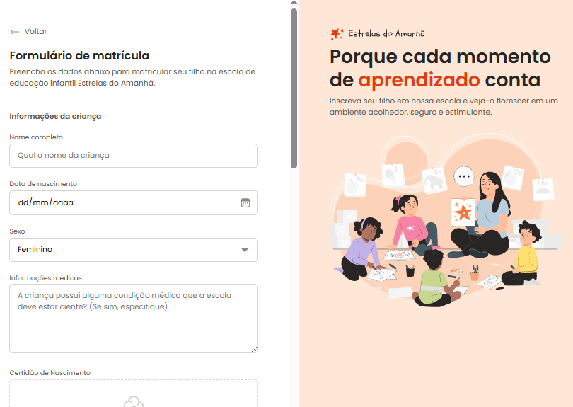

# 📝 Formulário de Matrícula

## Cadastro de Alunos

<div align="center">
  
</div>

Este projeto é um formulário de matrícula desenvolvido em **HTML5 e CSS3**, permitindo que usuários preencham e enviem informações de matrícula de forma simples, eficiente e segura.

---

## 🧭 Descrição

O objetivo deste projeto é facilitar o cadastro de alunos, organizando os dados de matrícula em uma aplicação moderna, com validação de campos e estrutura modular.

---

## ✨ Funcionalidades

- ✅ Cadastro de informações pessoais do aluno
- 🏫 Seleção de curso e turma
- 📅 Validação de dados obrigatórios
- 🔒 Segurança no tratamento dos dados
- 📤 Envio dos dados para processamento
- 🖥️ Interface intuitiva e responsiva

---

## 🖼️ Prévia do Projeto

<div align="center">
  
</div>

---

## ⚙️ Tecnologias Utilizadas

- HTML5
- CSS3

---

## 📁 Estrutura de Pastas

```
formulario_de_matricula/
│
├── assets/
│   ├── form_preview.png
│   ├── Illustration.svg
│   ├── logo.svg
│   ├── project_cover.png
│   └── types/
│       └── icons/...
│
├── styles/
│   └── forms.css
│   └── global.css
│   └── index.css
│   └── layout.css
│   └── fields/
│       └── buttons.css
│       └── checkbox.css
│       └── droparea.css
│       └── index.css
│       └── input.css
│       └── radio.css
│
├── index.html
└── README.md
```

---

## 📚 Aprendizados Aplicados

- Estruturação semântica com HTML5
- Estilização modular com CSS separado por arquivos
- Uso de variáveis CSS para padronização
- Tipografia com Google Fonts
- Validação de dados de formulário
- Organização modular do código
- Boas práticas de responsividade e espaçamento

---

## ✍️ Autor

Desenvolvido por **Rocketseat**  
Adaptado e implementado por **William Milanez**

---

## 📄 Licença

Este projeto é de uso educacional e livre para fins de estudo e prática pessoal.
